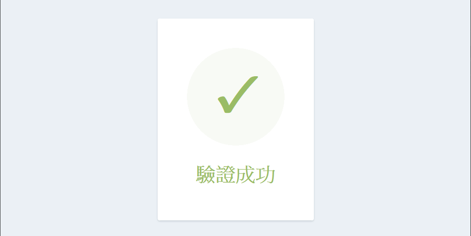

#### 架構圖

---

#### GoUser
 * 顯示網頁
 * 註冊帳號
 * 信箱重複檢查
 * 產生註冊帳號 token
 * 產生信箱驗證 token
 * 顯示信箱驗證結果

---

#### GoLogger
* 註冊帳號紀錄
* 信箱驗證紀錄

---

#### GoMail
* 接收 rabbitmq 訊息
* 寄出驗證郵件

---

#### Postgres
* 會員列表，[資料表](./postgres/init.sql)

---

#### MongoDB
* 紀錄 log

---

#### Redis
* DB0 暫存網頁註冊 token，存活10分鐘
* DB1 暫存信箱驗證 token，存活30分鐘

---

#### Dockerfile
1. 使用版本號 golang 1.17.3 作為編譯環境
2. 指定工作資料夾
3. 複製程式碼
4. 下載程式碼所用套件
5. 編譯目標 linux 的二進制檔
6. 使用最小 linux 作為執行環境
7. 指定工作資料夾
8. 從編譯環境複製執行檔與設定檔
9. 執行二進制檔

---

#### 執行測試
delete_files.bat 刪除資料庫資料並重建立資料夾  
執行 run.bat 會執行 docker-compose  
一切完成後，網址輸入 http://127.0.0.1/create  

1. 註冊畫面 
2. 建立帳號成功 
3. 驗證信箱，打開連結 
4. 驗證畫面 